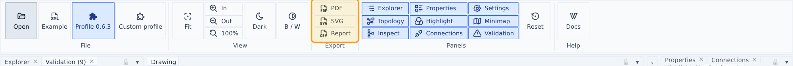

# Exports

Ribbon → Export:

- **SVG** — a spec-mapped, standalone SVG of the drawing with full visual fidelity.
- **PDF** — a vector PDF with embedded metric-compatible fonts (Carlito / Liberation / DejaVu subsets).
- **CSV** — the validation findings as a CSV file, with your severity overrides applied.
- **Excel** — the same findings as an Excel workbook (`.xlsx`): a frozen, bold header row, an auto-filter on every column and `line` as a real number, so sorting and filtering work with a double-click on Windows. No delimiter or locale guessing, unlike CSV.

Both reports carry the same columns:

| column | what it holds |
| --- | --- |
| `rule` | rule id, e.g. `SCH-002` |
| `category` | Schema, Graphics, Connectivity, Model or Meta data |
| `severity` | error, warning or info (after your overrides) |
| `objectId` | the object to select in the viewer, when the finding has one |
| `line` | source line of the offending element in your XML file |
| `xpath` | positional XPath of that element, e.g. `/Model/Object[1]/Components/Object/References[2]` |
| `message` | what is wrong |

`line` and `xpath` point at the element the finding is really about — for a dangling reference, the `<References>` element itself, not just the object that owns it — so you can jump straight to it in your XML editor.

The Validation panel has the same two buttons (**CSV**, **Excel**) in its toolbar; they export exactly what the panel's severity overrides say.

Drawing labels always use conventional unit symbols (barg, °C, m³/h) regardless of the unit-display setting.
