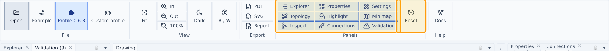
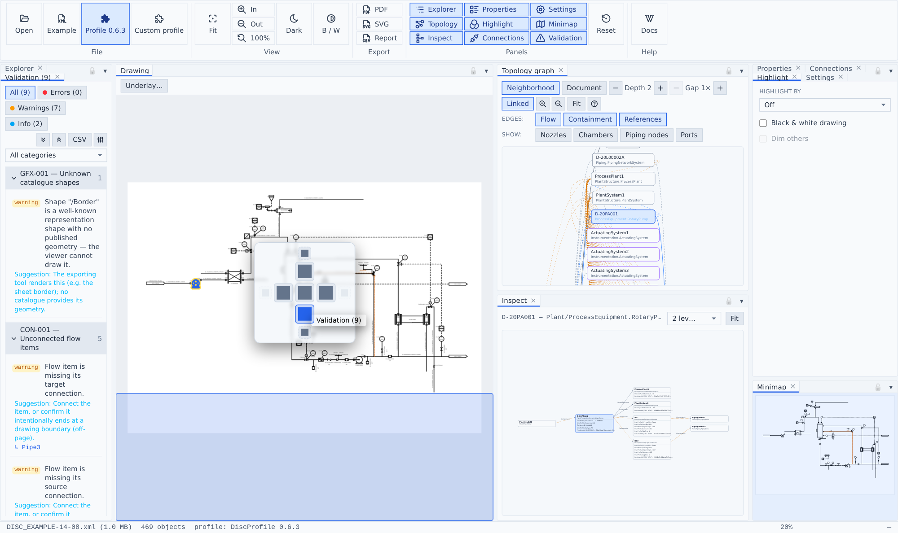

# Getting started

## Opening files

- **Open** (ribbon → File) or drag-and-drop a DEXPI 2.0 XML file anywhere onto the app.
- **Example** loads a bundled official DISC example sheet.
- **Profile 0.6.3** loads the bundled official DISC profile so `Profile/SymbolUsage` references resolve; **Custom profile** loads your own `DiscProfile.xml`. The loaded profile survives document changes and is shown in the status bar.

Only the DEXPI 2.0 XML serialization is supported (Proteus 4.x files from the DEXPI 1.x era are out of scope).

## The workbench

Dockable panels around a central drawing: Explorer and Validation on the left, Properties / Connections / Highlight / Settings on the right with the Minimap below, and Topology graph + Inspect as collapsed rails next to the drawing (click their chevron to expand).

The panel shell is the [tredespace UI](https://tredespace.com/docs/widgets) workbench, so every panel is fully rearrangeable:

- **Drag** a panel by its tab to dock it anywhere — side by side, stacked, or dropped onto another panel to form a **tab group**.
- **Float** a panel out of the dock into its own dialog window by dragging it free; re-dock it the same way.
- **Collapse** a panel group to a slim rail with the chevron in its header (Topology graph and Inspect start collapsed) and click the rail to expand it; the `▾` in a group header shrinks or restores the group in place.
- **Resize** any column or row by dragging the splitters between panels; close a panel with its tab's `×`.
- Toggle any panel on or off from ribbon → **Panels**.

The layout persists across sessions; if you get lost, ribbon → **Reset** restores the default layout.

## Status bar

File name and size, object count, loaded profile, zoom, and the cursor position in drawing millimetres.
