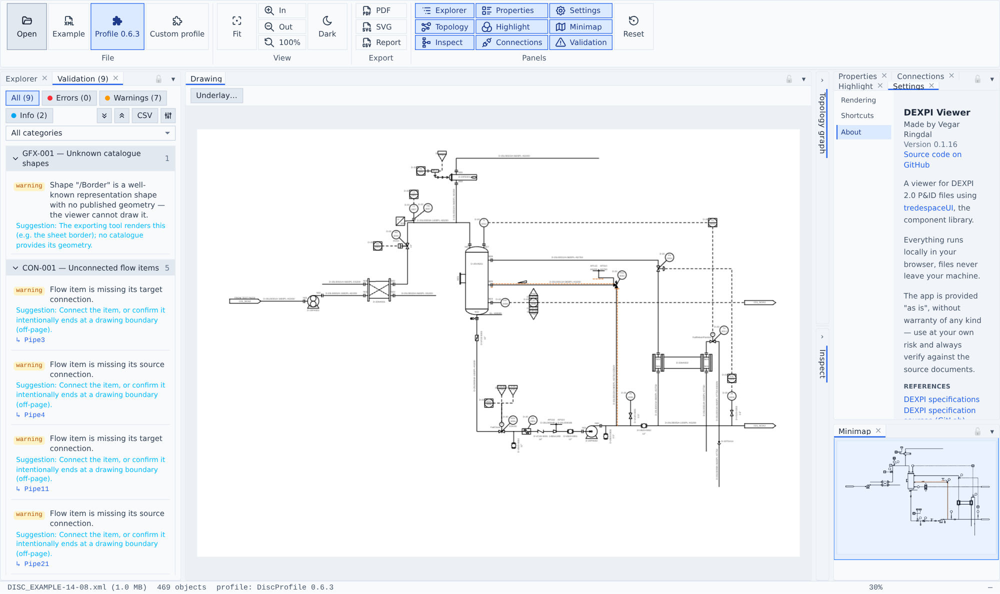

# Getting started

## Opening files

- **Open** (ribbon → File) or drag-and-drop a DEXPI 2.0 XML file anywhere onto the app.
- **Example** loads a bundled official DISC example sheet.
- **Profile 0.6.3** loads the bundled official DISC profile so `Profile/SymbolUsage` references resolve; **Custom profile** loads your own `DiscProfile.xml`. The loaded profile survives document changes and is shown in the status bar.

Only the DEXPI 2.0 XML serialization is supported (Proteus 4.x files from the DEXPI 1.x era are out of scope).

## The workbench

Dockable panels around a central drawing: Explorer and Validation on the left, Properties / Connections / Highlight / Settings on the right with the Minimap below, and Topology graph + Inspect as collapsed rails next to the drawing (click their chevron to expand). Every panel can be dragged, tabbed, floated, resized, or toggled from ribbon → Panels; the layout persists across sessions and **Reset** restores the default.

## Status bar

File name and size, object count, loaded profile, zoom, and the cursor position in drawing millimetres.
