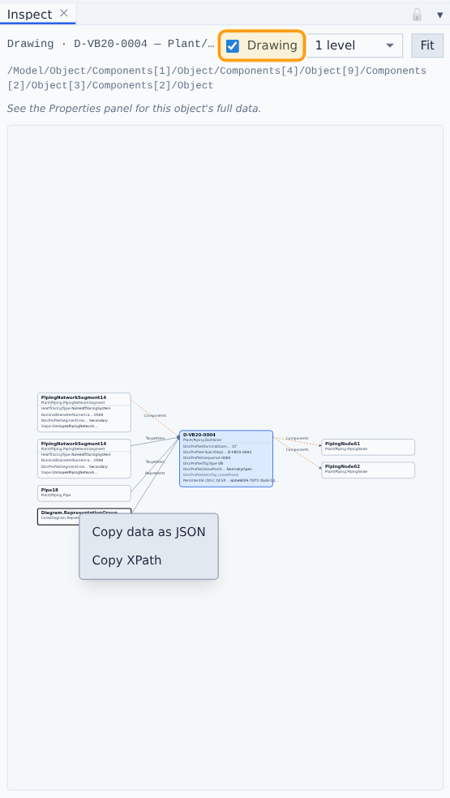

# Inspect panel

A UML-style instance diagram of the selected object — the debug view for "how is this connected", without reading raw XML.

- The **center card** shows the object's complete raw data — every property, including ones carrying `<Undefined/>` values (shown dimmed, never hidden).
- **Neighbor cards** show every relation with the edge labeled by the actual property name: outgoing References (right), reverse *referenced-by* and the containment parent (left), component children, and DISC-profile instance stubs (violet) carrying the published instance's data.
- The **depth selector** (1–3 levels) chains incoming relations leftward and outgoing rightward.
- **Click a neighbor** to re-center on it — the clicked card's position is pinned so the view never jumps; the global selection follows.
- **Problems show structurally, in red**: a finding that names a property becomes a red *row* — a red `(missing)` row for a property that should be there, or the existing row turned red when its value is invalid — with the full finding message in the row's tooltip. Cards keep their severity-colored border; only findings that don't map to a property (unknown class, connectivity, …) remain as compact ⚠ rows. An unresolvable reference target renders as a fully red broken card with a red edge.

- **Drawing toggle** adds the drawing side of the file to the diagram: representation groups, labels, shapes, polylines. Drawing objects carry no ids in real files, so their positional XPath stands in as the identity, and their cards render with a **dashed border** — they never feed the plant-data views. A plant object then shows its `Represents` group as an incoming neighbor; clicking drawing cards re-centers within Inspect only, since nothing else in the app can address them. The header says `Drawing ·` while the mode is on, shows the centered object's **full XPath** (it pastes straight into `xmllint --xpath`), and a hint line says where the rest of the data lives — the Properties panel for plant objects, Inspect itself for drawing-side ones.
- **Right-click any card** for the copy menu: **Copy data as JSON** puts the object's complete raw data on the clipboard — every typed value, nested aggregates, multi-valued properties as arrays, references and components recursively, nothing folded into display strings — and **Copy XPath** copies the element's positional path. Rows that don't fit the card show their full value in a tooltip.
