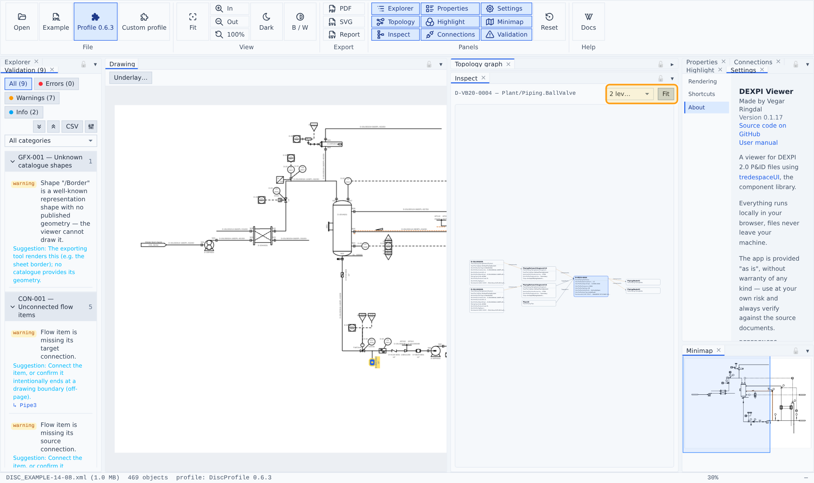

# Inspect panel

A UML-style instance diagram of the selected object — the debug view for "how is this connected", without reading raw XML.

- The **center card** shows the object's complete raw data — every property, including ones carrying `<Undefined/>` values (shown dimmed, never hidden).
- **Neighbor cards** show every relation with the edge labeled by the actual property name: outgoing References (right), reverse *referenced-by* and the containment parent (left), component children, and DISC-profile instance stubs (violet) carrying the published instance's data.
- The **depth selector** (1–3 levels) chains incoming relations leftward and outgoing rightward.
- **Click a neighbor** to re-center on it — the clicked card's position is pinned so the view never jumps; the global selection follows.
- **Problems show in red**: cards carry their object's validation findings as severity-colored borders and ⚠ rows, and an unresolvable reference target renders as a fully red broken card with a red edge.
