# DiscProfile 0.6.3 symbol catalogue

Generated from the official `DiscProfile.xml` by `npm run generate:docs`, rendered with the app's own SVG emitter — 284 symbols.
Conditional variants render their default variant; label-template placeholders are listed per symbol.

| Symbol | Preview | Variants | Label templates |
| --- | --- | --- | --- |
| `ND0000` | *(label-only)* | 1 | — |
| `ND0001` |  | 1 | &lt;ObjectDisplayName&gt; |
| `ND0002` |  | 1 | &lt;ObjectDisplayName&gt; |
| `ND0003` |  | 1 | &lt;ProcessPlantIdentificationCode&gt;-&lt;PlantSystemIdentificationCode&gt; &lt;TagType&gt; &lt;ProcessInstrumentationFunctionNumber&gt;&lt;TagSuffix&gt; &lt;NonSasFunction&gt; |
| `ND0004` |  | 3 (ValvePosition=NormallyClose; ValvePosition=OneNormallyCloseAngle) | &lt;ObjectDisplayName&gt; ⏎ &lt;NominalDiameterRepresentation&gt;&lt;ValveDataSheet&gt; ⏎ &lt;TrimType&gt; &lt;LockMechanism&gt; |
| `ND0005` |  | 3 (ValvePosition=NormallyClose; ValvePosition=OneNormallyCloseAngle) | &lt;ObjectDisplayName&gt; ⏎ &lt;NominalDiameterRepresentation&gt;&lt;ValveDataSheet&gt; ⏎ &lt;TrimType&gt; &lt;LockMechanism&gt; |
| `ND0006` |  | 1 | &lt;ProcessPlantIdentificationCode&gt;-&lt;PlantSystemIdentificationCode&gt; &lt;TagType&gt; &lt;ProcessInstrumentationFunctionNumber&gt;&lt;TagSuffix&gt; &lt;SetPoint&gt; H=' &amp; SignalConveyingFunction:&lt;AlarmValue&gt; HH=' &amp; SignalConveyingFunction:&lt;AlarmValue&gt; L=' &amp; SignalConveyingFunction:&lt;AlarmValue&gt; LL=' &amp; SignalConveyingFunction:&lt;AlarmValue&gt; |
| `ND0007` |  | 1 | &lt;BreakValue1&gt; &lt;BreakValue2&gt; |
| `ND0008A` |  | 1 | &lt;ReferencedDrawingNumber&gt; &lt;ReferencedDrawingDescriptor&gt; |
| `ND0008B` |  | 1 | &lt;ReferencedDrawingNumber&gt; &lt;ReferencedDrawingDescriptor&gt; |
| `ND0009A` |  | 1 | &lt;ReferencedDrawingNumber&gt; &lt;ReferencedDrawingDescriptor&gt; |
| `ND0009B` |  | 1 | &lt;ReferencedDrawingNumber&gt; &lt;ReferencedDrawingDescriptor&gt; |
| `ND0010` |  | 1 | — |
| `ND0012` |  | 2 (ValvePosition=NormallyClose) | &lt;ObjectDisplayName&gt; ⏎ &lt;NominalDiameterRepresentation&gt;&lt;ValveDataSheet&gt; ⏎ &lt;TrimType&gt; &lt;LockMechanism&gt; |
| `ND0012A` |  | 2 (ValvePosition=NormallyClose) | &lt;NominalDiameterRepresentation&gt;&lt;ValveDataSheet&gt; ⏎ &lt;TrimType&gt; &lt;LockMechanism&gt; |
| `ND0013` |  | 1 | — |
| `ND0014` |  | 1 | — |
| `ND0015` |  | 1 | &lt;ObjectDisplayName&gt; |
| `ND0016` |  | 1 | — |
| `ND0017` |  | 1 | — |
| `ND0018` |  | 1 | — |
| `ND0019` |  | 1 | &lt;TypeCode&gt; |
| `ND0020` |  | 1 | — |
| `ND0021` |  | 1 | — |
| `ND0022` |  | 1 | — |
| `ND0023` |  | 1 | &lt;ProcessPlantIdentificationCode&gt;-&lt;PlantSystemIdentificationCode&gt; &lt;TagType&gt; &lt;ProcessInstrumentationFunctionNumber&gt;&lt;TagSuffix&gt; |
| `ND0024` |  | 1 | &lt;ProcessPlantIdentificationCode&gt;-&lt;PlantSystemIdentificationCode&gt; &lt;TagType&gt; &lt;ProcessInstrumentationFunctionNumber&gt;&lt;TagSuffix&gt; |
| `ND0025` |  | 1 | &lt;ProcessPlantIdentificationCode&gt;-&lt;PlantSystemIdentificationCode&gt; &lt;TagType&gt; &lt;ProcessInstrumentationFunctionNumber&gt;&lt;TagSuffix&gt; |
| `ND0026` |  | 2 (PlugState=Open) | — |
| `ND0027` |  | 1 | &lt;ObjectDisplayName&gt; |
| `ND0028` |  | 1 | &lt;ObjectDisplayName&gt; |
| `ND0029` |  | 2 (ValvePosition=NormallyClose) | &lt;ObjectDisplayName&gt; ⏎ &lt;NominalDiameterRepresentation&gt;&lt;ValveDataSheet&gt; ⏎ &lt;TrimType&gt; &lt;LockMechanism&gt; |
| `ND0029A` |  | 2 (ValvePosition=NormallyClose) | &lt;NominalDiameterRepresentation&gt;&lt;ValveDataSheet&gt; ⏎ &lt;TrimType&gt; &lt;LockMechanism&gt; |
| `ND0030` |  | 2 (ValvePosition=NormallyClose) | &lt;ObjectDisplayName&gt; ⏎ &lt;NominalDiameterRepresentation&gt;&lt;ValveDataSheet&gt; ⏎ &lt;TrimType&gt; &lt;LockMechanism&gt; |
| `ND0030A` |  | 2 (ValvePosition=NormallyClose) | &lt;NominalDiameterRepresentation&gt;&lt;ValveDataSheet&gt; ⏎ &lt;TrimType&gt; &lt;LockMechanism&gt; |
| `ND0031` |  | 1 | &lt;ObjectDisplayName&gt; |
| `ND0032` |  | 1 | — |
| `ND0033` |  | 1 | &lt;ObjectDisplayName&gt; |
| `ND0034A` |  | 1 | &lt;ReferencedDrawingNumber&gt; &lt;ReferencedDrawingDescriptor&gt; |
| `ND0034B` |  | 1 | &lt;ReferencedDrawingNumber&gt; &lt;ReferencedDrawingDescriptor&gt; |
| `ND0034C` |  | 1 | &lt;ReferencedDrawingNumber&gt; &lt;ReferencedDrawingDescriptor&gt; |
| `ND0034D` |  | 1 | &lt;ReferencedDrawingNumber&gt; &lt;ReferencedDrawingDescriptor&gt; |
| `ND0035` |  | 1 | — |
| `ND0036` |  | 1 | — |
| `ND0037` |  | 1 | — |
| `ND0038` |  | 1 | — |
| `ND0039` |  | 1 | — |
| `ND0040` | *(label-only)* | 1 | &lt;ObjectDisplayName&gt; |
| `ND0041` | *(label-only)* | 1 | EL: &lt;Elevation&gt; |
| `ND0042A` |  | 2 (ValvePosition=NormallyClose) | &lt;ObjectDisplayName&gt; ⏎ &lt;NominalDiameterRepresentation&gt;&lt;ValveDataSheet&gt; ⏎ &lt;TrimType&gt; &lt;LockMechanism&gt; |
| `ND0042B` |  | 2 (ValvePosition=NormallyClose) | &lt;NominalDiameterRepresentation&gt;&lt;ValveDataSheet&gt; ⏎ &lt;TrimType&gt; &lt;LockMechanism&gt; |
| `ND0043` |  | 1 | &lt;TieInPointIdentifier&gt; ⏎ &lt;CommissioningPackage&gt; &lt;ProcessPlantIdentificationCode&gt;-&lt;PlantSystemIdentificationCode&gt; |
| `ND0044` |  | 1 | &lt;ObjectDisplayName&gt; |
| `ND0045` |  | 1 | &lt;ObjectDisplayName&gt; ⏎ &lt;JointConnectionSize&gt; |
| `ND0046` |  | 1 | &lt;ObjectDisplayName&gt; |
| `ND0048` |  | 1 | &lt;SpecialItemNumber&gt; |
| `ND0049` |  | 1 | &lt;TypeCode&gt; &lt;FailAction&gt; |
| `ND0050` |  | 1 | &lt;TypeCode&gt; |
| `ND0051` |  | 1 | — |
| `ND0052` |  | 1 | — |
| `ND0053` | 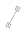 | 1 | — |
| `ND0054` |  | 1 | &lt;FailAction&gt; |
| `ND0055` |  | 1 | &lt;FailAction&gt; |
| `ND0056` |  | 1 | &lt;FailAction&gt; |
| `ND0057` | 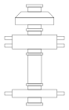 | 1 | &lt;ObjectDisplayName&gt; |
| `ND0058` | 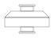 | 1 | &lt;ObjectDisplayName&gt; |
| `ND0059` |  | 1 | &lt;ObjectDisplayName&gt; |
| `ND0060` | 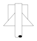 | 1 | &lt;ObjectDisplayName&gt; |
| `ND0061` |  | 1 | &lt;ObjectDisplayName&gt; |
| `ND0062` |  | 1 | &lt;ObjectDisplayName&gt; |
| `ND0063` | 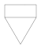 | 1 | &lt;ObjectDisplayName&gt; |
| `ND0064` | 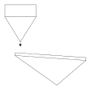 | 1 | &lt;ObjectDisplayName&gt; |
| `ND0065` | 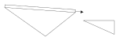 | 1 | &lt;ObjectDisplayName&gt; |
| `ND0066` | 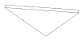 | 1 | &lt;ObjectDisplayName&gt; |
| `ND0067` |  | 1 | &lt;ObjectDisplayName&gt; |
| `ND0068` |  | 1 | &lt;ObjectDisplayName&gt; |
| `ND0069` |  | 1 | &lt;ObjectDisplayName&gt; |
| `ND0070` |  | 1 | &lt;ObjectDisplayName&gt; |
| `ND0071` |  | 1 | &lt;ObjectDisplayName&gt; |
| `ND0072` | 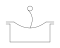 | 1 | &lt;ObjectDisplayName&gt; |
| `ND0073` |  | 1 | &lt;ObjectDisplayName&gt; |
| `ND0074` |  | 1 | — |
| `ND0075` |  | 1 | &lt;ObjectDisplayName&gt; |
| `ND0076` |  | 1 | &lt;ObjectDisplayName&gt; |
| `ND0077` |  | 1 | &lt;NominalDiameterRepresentationIn&gt;x&lt;NominalDiameterRepresentationOut&gt; |
| `ND0078` |  | 1 | &lt;NominalDiameterRepresentationIn&gt;x&lt;NominalDiameterRepresentationOut&gt; |
| `ND0079` |  | 1 | &lt;ObjectDisplayName&gt; |
| `ND0080` |  | 1 | &lt;ObjectDisplayName&gt; |
| `ND0081` |  | 1 | — |
| `ND0082A` |  | 1 | &lt;ObjectDisplayName&gt; |
| `ND0082B` |  | 1 | &lt;ObjectDisplayName&gt; |
| `ND0084` |  | 1 | — |
| `ND0085` |  | 1 | — |
| `ND0086` |  | 1 | &lt;ObjectDisplayName&gt; |
| `ND0087` |  | 1 | &lt;ObjectDisplayName&gt; |
| `ND0088` |  | 1 | &lt;ObjectDisplayName&gt; |
| `ND0089` |  | 1 | &lt;ObjectDisplayName&gt; |
| `ND0090` |  | 1 | &lt;ObjectDisplayName&gt; |
| `ND0091` |  | 1 | &lt;ObjectDisplayName&gt; |
| `ND0092` | 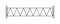 | 1 | &lt;ObjectDisplayName&gt; |
| `ND0093` |  | 1 | &lt;ObjectDisplayName&gt; |
| `ND0094` |  | 1 | &lt;ObjectDisplayName&gt; |
| `ND0095` |  | 1 | &lt;ObjectDisplayName&gt; |
| `ND0096` |  | 1 | &lt;ObjectDisplayName&gt; |
| `ND0097` |  | 1 | &lt;ObjectDisplayName&gt; &lt;TypeCode&gt; |
| `ND0098` |  | 1 | &lt;ObjectDisplayName&gt; &lt;TypeCode&gt; |
| `ND0099` |  | 1 | &lt;ObjectDisplayName&gt; |
| `ND0100` |  | 1 | &lt;ObjectDisplayName&gt; |
| `ND0101` |  | 1 | &lt;ObjectDisplayName&gt; |
| `ND0102` |  | 1 | &lt;ObjectDisplayName&gt; |
| `ND0103` |  | 1 | &lt;ObjectDisplayName&gt; |
| `ND0104` |  | 1 | &lt;ObjectDisplayName&gt; |
| `ND0105` |  | 1 | &lt;ObjectDisplayName&gt; |
| `ND0106` |  | 1 | &lt;ObjectDisplayName&gt; |
| `ND0107` |  | 1 | &lt;ObjectDisplayName&gt; |
| `ND0108` |  | 1 | &lt;ObjectDisplayName&gt; |
| `ND0109` |  | 1 | &lt;ObjectDisplayName&gt; |
| `ND0110` |  | 1 | &lt;ObjectDisplayName&gt; |
| `ND0111` |  | 1 | &lt;ObjectDisplayName&gt; |
| `ND0112` |  | 1 | &lt;ObjectDisplayName&gt; |
| `ND0113` |  | 1 | &lt;ObjectDisplayName&gt; |
| `ND0114` | 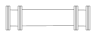 | 1 | &lt;ObjectDisplayName&gt; |
| `ND0115` |  | 1 | &lt;ObjectDisplayName&gt; |
| `ND0116` |  | 1 | &lt;ObjectDisplayName&gt; |
| `ND0117` |  | 1 | &lt;ObjectDisplayName&gt; |
| `ND0118` | 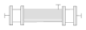 | 1 | &lt;ObjectDisplayName&gt; |
| `ND0119` |  | 1 | &lt;ObjectDisplayName&gt; |
| `ND0120` |  | 1 | &lt;ObjectDisplayName&gt; |
| `ND0121` |  | 1 | — |
| `ND0122` |  | 1 | — |
| `ND0123` |  | 1 | — |
| `ND0124` |  | 1 | &lt;TypeCode&gt; |
| `ND0125` |  | 1 | — |
| `ND0126` |  | 1 | — |
| `ND0127` |  | 1 | — |
| `ND0128` |  | 1 | — |
| `ND0129` |  | 1 | &lt;ProcessPlantIdentificationCode&gt;-&lt;PlantSystemIdentificationCode&gt; &lt;TagType&gt; &lt;Sequence&gt;&lt;TagSuffix&gt; |
| `ND0130` |  | 1 | &lt;ProcessPlantIdentificationCode&gt;-&lt;PlantSystemIdentificationCode&gt; &lt;TagType&gt; &lt;Sequence&gt;&lt;TagSuffix&gt; |
| `ND0131` |  | 1 | — |
| `ND0132` |  | 1 | — |
| `ND0133` |  | 1 | — |
| `ND0134` |  | 1 | — |
| `ND0135` |  | 1 | — |
| `ND0136` |  | 1 | &lt;ObjectDisplayName&gt; |
| `ND0137` |  | 1 | &lt;ObjectDisplayName&gt; |
| `ND0138` |  | 1 | &lt;ObjectDisplayName&gt; |
| `ND0139` |  | 1 | &lt;ObjectDisplayName&gt; |
| `ND0140` |  | 1 | &lt;ObjectDisplayName&gt; |
| `ND0141` |  | 1 | &lt;ObjectDisplayName&gt; |
| `ND0142` |  | 1 | &lt;ObjectDisplayName&gt; |
| `ND0143` |  | 1 | &lt;ObjectDisplayName&gt; |
| `ND0144` |  | 1 | &lt;ObjectDisplayName&gt; |
| `ND0145` |  | 1 | &lt;ObjectDisplayName&gt; |
| `ND0146` |  | 1 | &lt;ObjectDisplayName&gt; |
| `ND0147` |  | 1 | &lt;ObjectDisplayName&gt; |
| `ND0148` |  | 1 | &lt;ObjectDisplayName&gt; |
| `ND0149` |  | 1 | &lt;ObjectDisplayName&gt; |
| `ND0150` |  | 1 | &lt;ObjectDisplayName&gt; |
| `ND0151` |  | 1 | &lt;ObjectDisplayName&gt; |
| `ND0152` |  | 1 | &lt;ObjectDisplayName&gt; |
| `ND0153` |  | 2 (BlindPosition=NormallyClose) | — |
| `ND0154` |  | 1 | — |
| `ND0155` |  | 1 | — |
| `ND0156` |  | 1 | — |
| `ND0157` |  | 1 | — |
| `ND0158` |  | 1 | — |
| `ND0159` |  | 1 | — |
| `ND0160` |  | 1 | — |
| `ND0161` |  | 1 | — |
| `ND0162` |  | 1 | &lt;ObjectDisplayName&gt; |
| `ND0163` |  | 1 | &lt;ObjectDisplayName&gt; |
| `ND0164` |  | 1 | &lt;ObjectDisplayName&gt; |
| `ND0165` |  | 1 | &lt;ObjectDisplayName&gt; |
| `ND0166` | 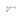 | 1 | &lt;ObjectDisplayName&gt; |
| `ND0167` |  | 1 | &lt;ObjectDisplayName&gt; |
| `ND0168` | 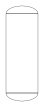 | 1 | &lt;ObjectDisplayName&gt; |
| `ND0169` | 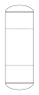 | 1 | &lt;ObjectDisplayName&gt; |
| `ND0170` | 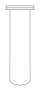 | 1 | &lt;ObjectDisplayName&gt; |
| `ND0171` | 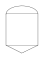 | 1 | &lt;ObjectDisplayName&gt; |
| `ND0172` |  | 1 | &lt;ObjectDisplayName&gt; |
| `ND0173` |  | 1 | &lt;ObjectDisplayName&gt; |
| `ND0174` |  | 1 | &lt;ObjectDisplayName&gt; |
| `ND0175` |  | 1 | &lt;ObjectDisplayName&gt; |
| `ND0176` |  | 1 | &lt;ObjectDisplayName&gt; |
| `ND0177` |  | 1 | &lt;ObjectDisplayName&gt; |
| `ND0178` |  | 1 | — |
| `ND0179` |  | 1 | — |
| `ND0180A` |  | 3 (ValvePosition=OneNormallyCloseStraight; ValvePosition=OneNormallyCloseAngle) | &lt;ObjectDisplayName&gt; ⏎ &lt;NominalDiameterRepresentation&gt;&lt;ValveDataSheet&gt; ⏎ &lt;TrimType&gt; &lt;LockMechanism&gt; |
| `ND0180B` |  | 3 (ValvePosition=OneNormallyCloseStraight; ValvePosition=OneNormallyCloseAngle) | &lt;NominalDiameterRepresentation&gt;&lt;ValveDataSheet&gt; ⏎ &lt;TrimType&gt; &lt;LockMechanism&gt; |
| `ND0181A` |  | 4 (ValvePosition=OneNormallyClose; ValvePosition=TwoNormallyCloseStraight; ValvePosition=TwoNormallyCloseAngle) | &lt;ObjectDisplayName&gt; ⏎ &lt;NominalDiameterRepresentation&gt;&lt;ValveDataSheet&gt; ⏎ &lt;TrimType&gt; &lt;LockMechanism&gt; |
| `ND0181B` |  | 4 (ValvePosition=OneNormallyClose; ValvePosition=TwoNormallyCloseStraight; ValvePosition=TwoNormallyCloseAngle) | &lt;NominalDiameterRepresentation&gt;&lt;ValveDataSheet&gt; ⏎ &lt;TrimType&gt; &lt;LockMechanism&gt; |
| `ND0182A` |  | 2 (ValvePosition=NormallyClose) | &lt;ObjectDisplayName&gt; ⏎ &lt;NominalDiameterRepresentation&gt;&lt;ValveDataSheet&gt; ⏎ &lt;TrimType&gt; &lt;LockMechanism&gt; |
| `ND0182B` |  | 2 (ValvePosition=NormallyClose) | &lt;NominalDiameterRepresentation&gt;&lt;ValveDataSheet&gt; ⏎ &lt;TrimType&gt; &lt;LockMechanism&gt; |
| `ND0183A` |  | 2 (ValvePosition=NormallyClose) | &lt;ObjectDisplayName&gt; ⏎ &lt;NominalDiameterRepresentation&gt;&lt;ValveDataSheet&gt; ⏎ &lt;TrimType&gt; &lt;LockMechanism&gt; |
| `ND0183B` |  | 2 (ValvePosition=NormallyClose) | &lt;NominalDiameterRepresentation&gt;&lt;ValveDataSheet&gt; ⏎ &lt;TrimType&gt; &lt;LockMechanism&gt; |
| `ND0184A` |  | 1 | &lt;ObjectDisplayName&gt; ⏎ &lt;NominalDiameterRepresentation&gt;&lt;ValveDataSheet&gt; ⏎ &lt;TrimType&gt; &lt;LockMechanism&gt; |
| `ND0184B` |  | 1 | &lt;NominalDiameterRepresentation&gt;&lt;ValveDataSheet&gt; ⏎ &lt;TrimType&gt; &lt;LockMechanism&gt; |
| `ND0185` |  | 1 | &lt;ObjectDisplayName&gt; ⏎ &lt;NominalDiameterRepresentation&gt;&lt;ValveDataSheet&gt; ⏎ &lt;TrimType&gt; &lt;LockMechanism&gt; |
| `ND0186` |  | 1 | &lt;NominalDiameterRepresentation&gt;&lt;ValveDataSheet&gt; ⏎ &lt;TrimType&gt; &lt;LockMechanism&gt; |
| `ND0187` |  | 1 | &lt;NominalDiameterRepresentation&gt;&lt;ValveDataSheet&gt; ⏎ &lt;TrimType&gt; &lt;LockMechanism&gt; |
| `ND0188` |  | 1 | &lt;ObjectDisplayName&gt; ⏎ &lt;NominalDiameterRepresentation&gt;&lt;ValveDataSheet&gt; ⏎ &lt;TrimType&gt; &lt;LockMechanism&gt; |
| `ND0189A` |  | 1 | &lt;ObjectDisplayName&gt; ⏎ &lt;NominalDiameterRepresentation&gt;&lt;ValveDataSheet&gt; ⏎ &lt;TrimType&gt; &lt;LockMechanism&gt; |
| `ND0189B` |  | 1 | &lt;NominalDiameterRepresentation&gt;&lt;ValveDataSheet&gt; ⏎ &lt;TrimType&gt; &lt;LockMechanism&gt; |
| `ND0190A` |  | 1 | &lt;ObjectDisplayName&gt; ⏎ &lt;NominalDiameterRepresentation&gt;&lt;ValveDataSheet&gt; ⏎ &lt;TrimType&gt; &lt;LockMechanism&gt; |
| `ND0190B` |  | 1 | &lt;NominalDiameterRepresentation&gt;&lt;ValveDataSheet&gt; ⏎ &lt;TrimType&gt; &lt;LockMechanism&gt; |
| `ND0191A` |  | 2 (ValvePosition=NormallyClose) | &lt;ObjectDisplayName&gt; ⏎ &lt;NominalDiameterRepresentation&gt;&lt;ValveDataSheet&gt; ⏎ &lt;TrimType&gt; &lt;LockMechanism&gt; |
| `ND0191B` |  | 2 (ValvePosition=NormallyClose) | &lt;NominalDiameterRepresentation&gt;&lt;ValveDataSheet&gt; ⏎ &lt;TrimType&gt; &lt;LockMechanism&gt; |
| `ND0192A` |  | 2 (ValvePosition=NormallyOpen) | &lt;ObjectDisplayName&gt; ⏎ &lt;NominalDiameterRepresentation&gt;&lt;ValveDataSheet&gt; ⏎ &lt;TrimType&gt; &lt;LockMechanism&gt; |
| `ND0192B` |  | 2 (ValvePosition=NormallyOpen) | &lt;NominalDiameterRepresentation&gt;&lt;ValveDataSheet&gt; ⏎ &lt;TrimType&gt; &lt;LockMechanism&gt; |
| `ND0193A` |  | 2 (ValvePosition=NormallyClose) | &lt;ObjectDisplayName&gt; ⏎ &lt;NominalDiameterRepresentation&gt;&lt;ValveDataSheet&gt; ⏎ &lt;TrimType&gt; &lt;LockMechanism&gt; |
| `ND0193B` |  | 2 (ValvePosition=NormallyClose) | &lt;NominalDiameterRepresentation&gt;&lt;ValveDataSheet&gt; ⏎ &lt;TrimType&gt; &lt;LockMechanism&gt; |
| `ND0194` |  | 1 | &lt;ObjectDisplayName&gt; ⏎ &lt;NominalDiameterRepresentation&gt;&lt;ValveDataSheet&gt; ⏎ &lt;TrimType&gt; &lt;LockMechanism&gt; |
| `ND0195` |  | 1 | &lt;ObjectDisplayName&gt; ⏎ &lt;NominalDiameterRepresentation&gt;&lt;ValveDataSheet&gt; ⏎ &lt;TrimType&gt; &lt;LockMechanism&gt; |
| `ND0196A` |  | 2 (ValvePosition=NormallyClose) | &lt;ObjectDisplayName&gt; ⏎ &lt;NominalDiameterRepresentation&gt;&lt;ValveDataSheet&gt; ⏎ &lt;TrimType&gt; &lt;LockMechanism&gt; |
| `ND0196B` |  | 2 (ValvePosition=NormallyClose) | &lt;NominalDiameterRepresentation&gt;&lt;ValveDataSheet&gt; ⏎ &lt;TrimType&gt; &lt;LockMechanism&gt; |
| `ND0197` |  | 1 | &lt;ObjectDisplayName&gt; |
| `ND0198` |  | 1 | &lt;ObjectDisplayName&gt; |
| `ND0199` |  | 1 | — |
| `ND0200` |  | 1 | — |
| `ND0201` |  | 1 | — |
| `ND0202` |  | 1 | — |
| `ND0203` |  | 1 | — |
| `ND0204` |  | 1 | — |
| `ND0205` |  | 1 | &lt;ComponentIdentifier&gt; |
| `ND0206A` |  | 1 | &lt;ObjectDisplayName&gt; |
| `ND0206B` |  | 1 | &lt;ObjectDisplayName&gt; |
| `ND0208` |  | 1 | &lt;ObjectDisplayName&gt; |
| `ND0209` |  | 1 | &lt;ObjectDisplayName&gt; |
| `ND0210` |  | 1 | — |
| `ND0211` |  | 1 | — |
| `ND0212` |  | 1 | &lt;ObjectDisplayName&gt; |
| `ND0213` |  | 1 | &lt;ObjectDisplayName&gt; |
| `ND0214` |  | 1 | &lt;ObjectDisplayName&gt; |
| `ND0215` |  | 1 | &lt;ObjectDisplayName&gt; |
| `ND0216` |  | 1 | &lt;ObjectDisplayName&gt; |
| `ND0217` |  | 1 | &lt;ObjectDisplayName&gt; |
| `ND0218` |  | 1 | &lt;ObjectDisplayName&gt; |
| `ND0219` |  | 1 | &lt;ObjectDisplayName&gt; |
| `ND0220` |  | 1 | &lt;ObjectDisplayName&gt; |
| `ND0221` |  | 1 | &lt;ObjectDisplayName&gt; |
| `ND0222` |  | 1 | &lt;ObjectDisplayName&gt; |
| `ND0223` |  | 1 | &lt;ObjectDisplayName&gt; |
| `ND0224` |  | 1 | — |
| `ND0225A` |  | 1 | &lt;ReferencedDrawingNumber&gt; &lt;ReferencedDrawingDescriptor&gt; &lt;ReferencedDrawingMainTag&gt; |
| `ND0225B` |  | 1 | &lt;ReferencedDrawingNumber&gt; &lt;ReferencedDrawingDescriptor&gt; &lt;ReferencedDrawingMainTag&gt; |
| `ND0226` |  | 1 | &lt;ObjectDisplayName&gt; |
| `ND0227` |  | 1 | &lt;ObjectDisplayName&gt; |
| `ND0228` | 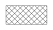 | 1 | — |
| `ND0236` | 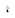 | 1 | — |
| `ND0237` |  | 1 | &lt;ObjectDisplayName&gt; ⏎ &lt;NominalDiameterRepresentation&gt;&lt;ValveDataSheet&gt; ⏎ &lt;TrimType&gt; &lt;LockMechanism&gt; |
| `ND0238` | 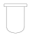 | 1 | &lt;ObjectDisplayName&gt; |
| `ND0239` |  | 1 | — |
| `ND0240` | 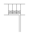 | 1 | — |
| `ND0241` |  | 1 | &lt;FailAction&gt; |
| `ND0242` | 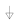 | 1 | &lt;BreakValue1&gt; &lt;BreakValue2&gt; |
| `ND0243` |  | 1 | — |
| `ND0244A` |  | 1 | &lt;ReferencedDrawingNumber&gt; &lt;ReferencedDrawingDescriptor&gt; |
| `ND0244B` |  | 1 | &lt;ReferencedDrawingNumber&gt; &lt;ReferencedDrawingDescriptor&gt; |
| `ND0245A` |  | 1 | &lt;ReferencedDrawingNumber&gt; &lt;ReferencedDrawingDescriptor&gt; |
| `ND0245B` |  | 1 | &lt;ReferencedDrawingNumber&gt; &lt;ReferencedDrawingDescriptor&gt; |
| `ND0246` |  | 1 | &lt;ObjectDisplayName&gt; |
| `ND0247` |  | 1 | &lt;ObjectDisplayName&gt; |
| `ND0248A` |  | 1 | &lt;ProcessPlantIdentificationCode&gt;-&lt;PlantSystemIdentificationCode&gt; &lt;TagType&gt; &lt;ProcessInstrumentationFunctionNumber&gt;&lt;TagSuffix&gt; |
| `ND0248B` |  | 1 | &lt;ProcessPlantIdentificationCode&gt;-&lt;PlantSystemIdentificationCode&gt; &lt;TagType&gt; &lt;Sequence&gt;&lt;TagSuffix&gt; &lt;TypicalReference&gt; &lt;SetPoint&gt; |
| `ND0249A` |  | 1 | &lt;ObjectDisplayName&gt; &lt;TypeCode&gt; &lt;ProcessPlantIdentificationCode&gt; |
| `ND0249B` |  | 1 | &lt;ObjectDisplayName&gt; &lt;ProcessPlantIdentificationCode&gt; |
| `ND0249C` |  | 1 | &lt;ObjectDisplayName&gt; &lt;TypeCode&gt; &lt;ProcessPlantIdentificationCode&gt; |
| `ND0250` |  | 1 | &lt;ObjectDisplayName&gt; |
| `ND0251` |  | 1 | — |
| `ND0252` | 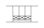 | 1 | — |
| `ND0253` | 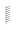 | 1 | — |
| `ND0254` |  | 1 | — |
| `ND0255` |  | 1 | — |
| `ND0256` |  | 1 | — |
| `ND0259` |  | 1 | — |
| `ND0260` |  | 1 | — |
| `ND0261A` |  | 1 | &lt;ReferencedDrawingNumber&gt; &lt;ReferencedDrawingDescriptor&gt; |
| `ND0261B` |  | 1 | &lt;ReferencedDrawingNumber&gt; &lt;ReferencedDrawingDescriptor&gt; |
| `ND0262` |  | 1 | — |
| `ND0263` |  | 1 | &lt;ObjectDisplayName&gt; |
| `ND0264` | 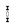 | 1 | — |
| `ND0265` |  | 1 | — |
| `ND0266` |  | 1 | — |
| `ND0267` |  | 1 | — |
