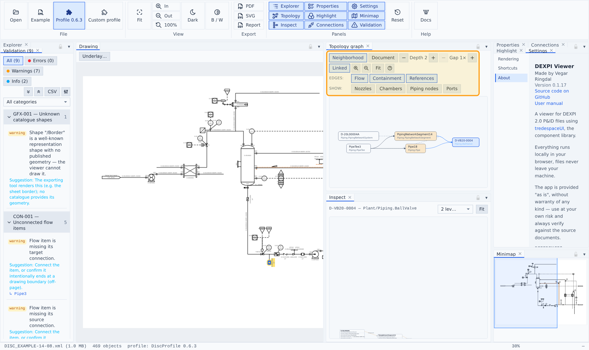
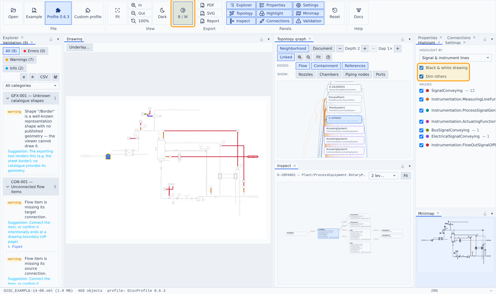

# Topology & highlighting

## Topology graph

The engineering data as a semantic network: plant objects as category-colored nodes with **flow**, **containment** and **reference** edges, laid out along the flow direction. Neighborhood mode graphs the current selection with an adjustable hop depth; Document mode graphs the whole file. Connection hardware (nozzles, chambers, piping nodes, ports) collapses into its owner or shows as mini nodes. Nodes sync with the global selection; double-click zooms the drawing.

## Connections & tracing

The Connections panel lists the selected object's flow neighbours and traces **upstream** (amber) / **downstream** (green) through the piping — the trace tints the drawing and recirculation loops are called out.

## Highlight

The Highlight panel tints the drawing by classification — heat-traced runs, signal/instrument lines, fluid code or piping class (with ancestor inheritance) — each value in its own color with a legend of counts and per-value visibility toggles. Signal mode groups **per signal semantics** (electrical, bus, measuring, …), so each type highlights in its own color. A **Black & white drawing** toggle (also the big **B/W** button in ribbon → View, which shows when it is on) renders the file's content in ink only, so highlight tints never mix with the drawing's own colors, and **Dim others** fades everything outside the highlighted groups so the tints stand out; the palette deliberately contains no blue — blue always means selection.

## Semantic signal-line styling

Signal lines render by their semantics, matching the official DISC renderings: measuring and hydraulic lines solid, plain signal lines dashed, electrical lines solid with bracket marks, bus lines dashed with circle marks.
