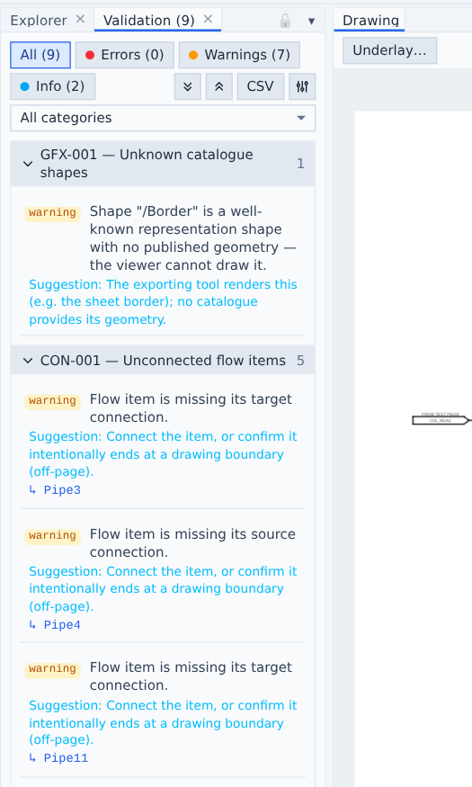
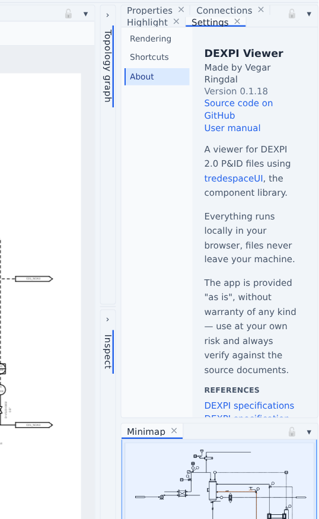

# Validation

Every loaded document is validated immediately; the Validation tab shows the count and auto-focuses when a document has findings.

## Rule families

Rules are grouped in five categories — see the full [rule reference](rules.md):

- **Schema (SCH)** — XML integrity: duplicate/dangling ids, identifier and reference syntax from the DEXPI XML Schema.
- **Graphics (GFX)** — drawing topology: unresolvable catalogue shapes, undrawable connectors, missing extent.
- **Connectivity (CON)** — engineering topology: unconnected flow items/nodes/nozzles, nominal-diameter mismatches at connection points, piping-class changes without a PropertyBreak.
- **Model (MDL)** — model-driven: every object checked against the DEXPI information model (unknown classes/properties, missing required properties, illegal enumeration literals, reference cardinality and target classes). The model version is taken from the document's `data.dexpi.org` Import URIs; profile extension classes are honoured through their declared supertypes.
- **Meta data (META)** — template attribute references that resolve to nothing.

## Working with findings

- Filter by severity and category; groups collapse per rule; **CSV** and **Excel** export the findings (see [Exports](export.md)).
- Click a finding's object link to select and zoom to it.
- The **severity configuration** (sliders icon) overrides any rule's severity — Error / Warning / Info / **Ignore** — persisted across sessions.

## Per-object findings

The Properties panel lists the selected object's own findings in an **Issues** section, and the [Inspect panel](inspect.md) paints affected cards with severity-colored borders and issue rows.

