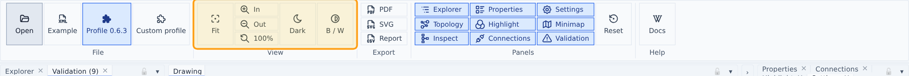
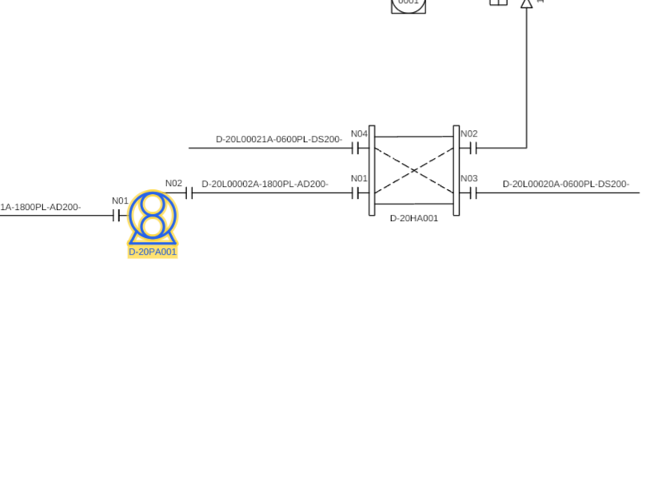
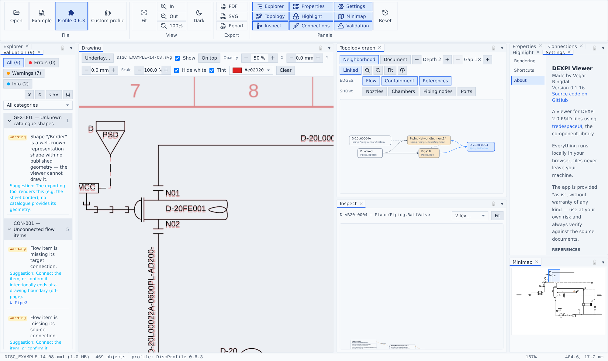

# Viewing the drawing

## Navigation

- Mouse wheel zooms at the cursor; drag pans. Ribbon → View has **Fit**, zoom in/out and **100%** (with hotkeys), plus the **Dark** theme and **B / W** monochrome toggles.
- The **Minimap** shows the whole sheet with a live viewport rectangle — click or drag it to navigate.
- Double-clicking objects in panels zooms the drawing to them.

## Selection

Click anything in the drawing to select it — the Explorer tree, Properties, Connections and Inspect all follow. Ctrl/Cmd-click toggles multi-selection (also on the canvas); Shift-click range-selects in the tree. Hovering rows in panels highlights the object on the canvas.

Selection renders as a **marker-pen yellow halo** tracing the object's own geometry underneath the blue re-stroke — not a bounding box, so a large exchanger doesn't flood its whole footprint. Selected **text** gets a filled yellow rect instead (embolden-by-doubling reads blurry); Settings → Rendering → *Backdrop behind selected text* turns that off. Dashed lines **stay dashed** when selected or highlighted — a selected heat-traced pipe keeps its trace distinguishable from the pipe itself.

## Verification underlay

The toolbar above the drawing loads a reference **image, SVG or PDF** as an alignment underlay, stretched onto the diagram extent — the official DISC renderings align exactly. Controls:

- **Show**, **On top** (draw over instead of under the drawing) and **Opacity**.
- **X / Y / Scale** nudges (0.1 mm steps) for scans that need alignment.
- **Hide white** multiply-blends the underlay so its paper background disappears — only its ink shows.
- **Tint** recolors the underlay's ink via a color picker (default red): red reference under black drawing makes any deviation pop.

When the underlay sits *under* the drawing, the sheet's white paper is suppressed automatically so the reference shows through.

## Rendering settings

Settings → Rendering: minimum stroke width (px), stroke width scale, grid, unit display (conventional symbols vs spec unit names in the Properties panel), and *Built-in signal-line styling* — forces the viewer's [signal-line convention](conventions.md) even when the loaded profile publishes its own LineStroke styling (useful while profile styling is early-stage).
