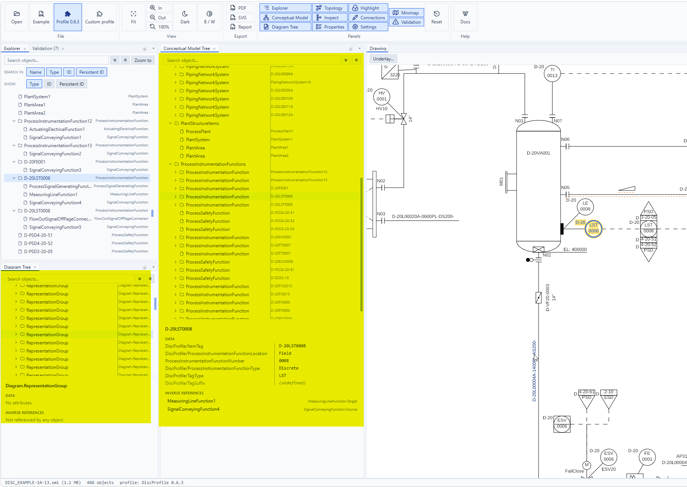

# Conceptual Model Tree & Diagram Tree

Two raw-XML browsers, off by default (ribbon → Panels → **Conceptual Model** / **Diagram Tree**) — for when you need to see the file exactly as it's structured, not the Explorer's flattened plant hierarchy.

- Each panel mirrors one `EngineeringModel` composition's containment exactly: one expandable group row per `<Components property=…>` bucket (e.g. `ActuatingSystems`, `PipingNetworkSystems`), one row per object underneath, nesting as deep as the file does. The **Conceptual Model Tree** covers `ConceptualModel`; the **Diagram Tree** covers the sibling `Diagram` composition (representation groups, labels, shapes).
- Rows show the bare **type** in the main column and the resolved value/tag (TagName, ItemTag, SegmentNumber, …) in a second column — drag the thin divider above the tree to resize it. Both trees start fully collapsed and expand to reveal whatever's currently selected; scrolling stays smooth even on a large, mostly-expanded subtree.
- Below the tree: the selected row's **Data** table (aggregate values like `Stroke`/`Color` render as an indented block instead of one flattened line) and **Inverse References** — every object that references this one, grouped by `ReferencingType.property` (e.g. `AttributeRepresentation.Object [2]`), collapsible when there's more than one target. Drag the handle between the tree and this section, or the attribute-column divider inside it, to resize either.
- Selection stays in sync everywhere: picking a row in either tree selects it in the drawing, Properties, and the Explorer, and vice versa. A Diagram Tree row additionally cross-links to the real conceptual object it draws or annotates via its own `Represents`/`Object` reference — Diagram-side objects carry no `id` in real files, so Diagram Tree rows use their positional XPath as identity internally, but selecting one still drives the global selection through that cross-link.
